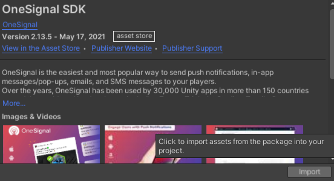
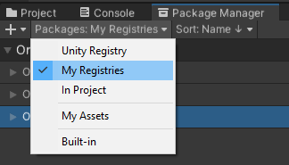
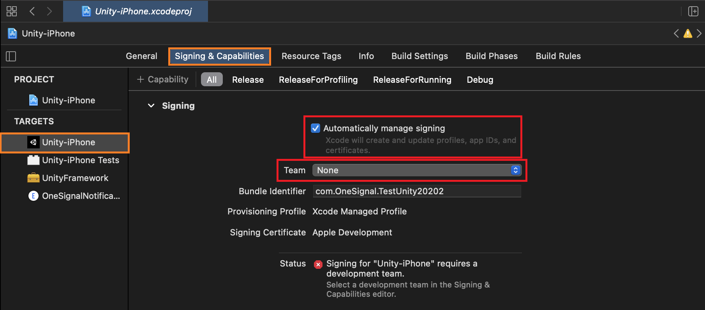
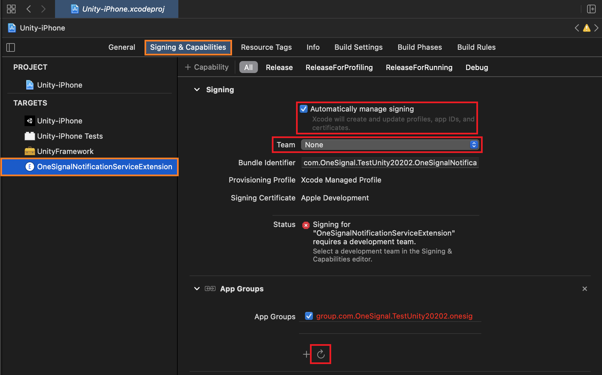

<p align="center">
  
</p>

# OneSignal Unity SDK
A free email, sms, push notification and in app messaging solution for mobile applications built through Unity.

[OneSignal](https://onesignal.com) provides a fully array of omni-channel messaging solutions across:

- Push Notifications (mobile & web)
- In App Messages
- SMS
- Email

And via many additional platforms. [Check them all out](https://documentation.onesignal.com/docs/sdk-reference)!

#### Table of Contents
- [Requirements](#requirements)
- [Push Notification Credentials](#push-notification-credentials)
- [Installation](#installation)
    - [Unity Asset Store](#installation)
    - [Unity Package Manager](#installation)
- [Platform Configuration](#platform-configuration)
    - [iOS](https://documentation.onesignal.com/docs/unity-sdk-setup#step-5---ios-setup)
    - [Android](https://documentation.onesignal.com/docs/unity-sdk-setup#step-6---android-setup)
- [Usage](#usage)
    - [Initialization](#initialization)

## Requirements
- A [OneSignal Account](https://app.onesignal.com/signup) if you do not already have one
- Your OneSignal App ID which you can find under **Settings > Keys & IDs**
- Unity 2018.4 or newer
- In order to test push notifications you will need
    - An Android 4.0.3 or newer device or emulator with "Google Play services" installed
    - An iOS 9 or newer device (iPhone, iPad, or iPod Touch)

## Push Notification Credentials
You must generate the appropriate credentials for the platform(s) you are releasing on:

- iOS - [Generate an iOS Push Certificate](https://documentation.onesignal.com/docs/generate-an-ios-push-certificate)
- Android - [Generate a Google Firebase Server API Key](https://documentation.onesignal.com/docs/generate-a-google-server-api-key)
- Amazon Fire - [Generate an Amazon API Key](https://documentation.onesignal.com/docs/generate-an-amazon-api-key)

## Installation
There are two methods of installation available for the OneSignal Unity SDK:
> **Upgrading from 2.x.x to 3.x.x?**</br>
> Please check out our [migration guide](MIGRATION.md).

<details>
<summary><b>Unity Asset Store</b> <i>(click to expand)</i></summary>

1. Add the OneSignal Unity SDK as an available asset to your account by clicking **Add to My Assets** from [our listing on the Unity Asset Store](https://assetstore.unity.com/packages/add-ons/services/billing/onesignal-sdk-193316).
2. Find the package waiting for you to download by clicking **Open in Unity** from that same page. This will open the Unity Editor and its Package Manager window.
3. On the SDK's listing in the Editor click the **Download** button. When it finishes click **Import**.

    

4. A prompt to import all of the files of the OneSignal Unity SDK will appear. Click **Import** to continue and compile the scripts into your project.
5. Navigate to **Window > OneSignal** (or follow the popup if upgrading) in the Unity Editor which will bring up a window with some final steps which need 
   to be completed in order to finalize the installation. The most important of these steps is **Import OneSignal packages**.
   
    > *Depending on your project configuration and if you are upgrading from a previous version, some of these steps may already be marked as "completed"*
   
    

6. After importing the packages Unity will notify you that a new registry has been added and the **OneSignal SDK Setup** window will have refreshed with a few additional 
   steps. Following these will finalize your installation of the OneSignal Unity SDK.
</details>

<details>
<summary><b>Unity Package Manager</b> <i>(click to expand)</i></summary>

1. From within the Unity Editor navigate to **Edit > Project Settings** and then to the **Package Manager** settings tab.
   
   

2. Create a *New Scoped Registry* by entering 
    ```
    Name        npmjs
    URL         https://registry.npmjs.org
    Scope(s)    com.onesignal
    ```
   and click **Save**.
3. Open the **Window > Package Manager** and switch to **My Registries** via the **Packages:** dropdown menu. You will see all of the OneSignal Unity SDK packages available
   on which you can then click **Install** for the platforms you would like to include. Dependencies will be added automatically.
4. Once the packages have finished importing you will find a new menu under **Window > OneSignal**. Open it and you will find some final steps which need to be completed
   in order to finalize the installation.

   > *Depending on your project configuration and if you are upgrading from a previous version, some of these steps may already be marked as "completed"*

   

</details>

## Platform Configuration
### iOS
After building in Unity and exporting the XCode project follow these steps:
1. To open your project ensure that you use the `.xcworkspace` file and not the `.xcodeproj` to open the project.
2. Click on the **Unity-iPhone** project and its similarly named target and select the **Signing & Capabilities** tab.
3. From here check **Automatically manage signing**, on the prompt click **Enable Automatic**, and select your **Team**.

   

4. Scroll down to **App Groups** and click on the refresh button.
    > NOTE: You may have to press this a few times as it will ask you for each signing type.

   

5. Repeat the same steps above but for the **OneSignalNotificationServiceExtension** target this time.

   

6. **App Groups** should now be provisioned for you going forward for your iOS bundle id, even on clean builds.

### Android
Most of the Android setup was already handled during installation!

The only thing remaining is to setup your own notification icons. You can do this be replacing the example icons located at `Assets/Plugins/Android/OneSignalConfig.plugin` 
with your own. There is a complete guide for this [in the plugin's README](com.onesignal.unity.android/Editor/OneSignalConfig.plugin/README.md). See our 
[Customize Notification Icons](https://documentation.onesignal.com/docs/customize-notification-icons) page for additional details.

## Usage
You can find a complete implementation in our included [example MonoBehaviour](Example/OneSignalExampleBehaviour.cs). Additionally we have included a
[sample scene](Example/Scenes/OneSignalExampleScene.unity) which you can run to test out the SDK.

### Initialization
#### Prefab
Located in the `com.onesignal.unity.core` package we've include a simple prefab which initializes OneSignal. You can easily find it using the Asset search bar
to find `OneSignalController.prefab` and making sure to select **All** or **In Packages** for your search option. Drag the prefab into your very first scene, fill
in the **App Id**, and you are immediately ready to go!

#### Code
To get started add the following code in an appropriate place such as the `Start` method of a `MonoBehaviour` early in your application's lifecycle.
```C#
// Replace 'YOUR_ONESIGNAL_APP_ID' with your OneSignal App ID from app.onesignal.com
OneSignal.Default.Initialize("YOUR_ONESIGNAL_APP_ID");
```

You are now ready to start sending and receiving notifications and in-app messages. For additional information please see [our complete OneSignal Unity SDK docs](https://documentation.onesignal.com/docs/unity-sdk-setup).

## API
See OneSignal's [OneSignal Unity SDK API](https://documentation.onesignal.com/docs/unity-sdk) page for a list of all available methods.

## Change Log
See this repository's [releases](https://github.com/OneSignal/OneSignal-Unity-SDK/releases) for a complete change log of every released version.

## Support
Please visit this repository's [Github issue tracker](https://github.com/OneSignal/OneSignal-Unity-SDK/issues) for feature requests and bug reports related specifically to the SDK.

For account issues and support please contact OneSignal support from the [OneSignal](https://onesignal.com) dashboard.

## License
[Modified MIT License](LICENSE)
